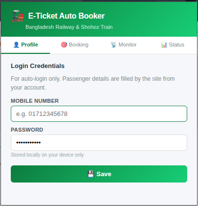
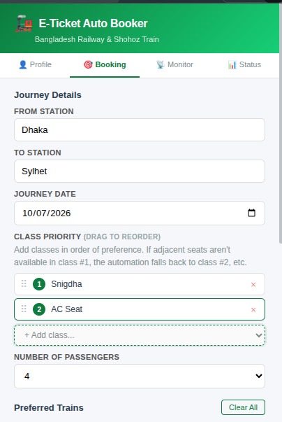
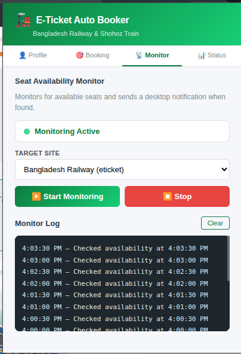
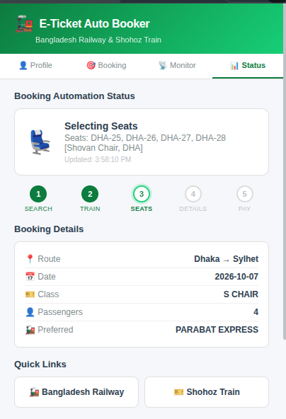

<div align="center">

# 🚂 E-DALAL: Automated Ticket Booking Agent

**A Browser Extension to Automate Bangladesh Railway ticket booking on [Shohoz](https://train.shohoz.com) and [Govt Railway Site](https://eticket.railway.gov.bd)**

Smart seat selection • Rush-mode score-and-strike booking • Class priority fallback • Retry limits • Real-time BD-timestamped logs

[](https://www.google.com/chrome/)
[](https://www.microsoft.com/edge)
[](https://www.mozilla.org/firefox/)
[](#license)

</div>

---

## 🇧🇩 Introduction

In Bangladesh, *dalals* (ticket brokers) and black market ticket dealers have turned train ticket booking into a ruthless business. The moment the booking window opens at **8:00 AM**, these operators — armed with bots, multiple devices, and insider tricks — snatch up every available seat within seconds. They then resell those tickets at 2x, 3x, or even higher prices to desperate travelers, especially during Eid, Puja, and holiday rushes when getting home is all that matters. And it gets worse — scammers prey on this desperation too, posting fake ticket offers on Facebook groups and messaging apps, collecting advance payments, and vanishing without a trace, leaving people both penniless and stranded. Ordinary passengers — the *mango people* — are left refreshing a crashed website with zero chance of getting a fair-priced ticket.

**This extension exists to level the playing field.** If the dalals can auto-book, so can you. E-DALAL lets regular passengers set up their booking preferences in advance and automatically grab tickets the instant they become available — no bots-for-hire, no shady middlemen, no inflated prices. Just you, your browser, and a fair shot at getting home.

## ✨ Features

- **🔐 Auto-Login** — Fills mobile number & password automatically (you solve the captcha)
- **🎯 Smart Train Selection** — Books only your preferred trains; won't silently fallback to another
- **💺 Intelligent Seat Picker** — Selects adjacent window+aisle pairs from center-most rows, honoring per-class pairing grids (Snigdha even-start pairs, S Chair odd-start, AC blocks of 3)
- **⚡ Rush Mode (score-and-strike)** — Books the *first* coach whose best group is within your strike threshold; event-driven waits instead of fixed sleeps, pre-ranked from dropdown text with zero DOM switching. Typical happy path: sub-second vs 20–30s in audit mode
- **🎯 Strike Threshold (0–3)** — How far off-center a group can be and still get booked instantly. Higher = books sooner; if no coach qualifies, the globally best-scoring one is booked anyway
- **📊 Class Priority** — Set fallback order (e.g., Snigdha → AC Seat → S Chair). Checks actual availability count before booking
- **🔄 Retry Limits** — Max 3 retries then stops. Prevents bans from excessive requests
- **📡 Seat Monitor** — Background monitoring with desktop notifications when seats become available
- **📝 Persistent Logs** — View, download, or clear logs from the popup. Debug issues easily
- **🛑 Instant Stop** — Stop button kills all automation immediately

## 📸 Screenshots

<div align="center">
<table>
<tr>
<td align="center"><b>Profile</b><br></td>
<td align="center"><b>Booking</b><br></td>
<td align="center"><b>Monitor</b><br></td>
<td align="center"><b>Status</b><br></td>
</tr>
</table>
</div>

## 🚀 Installation

### Google Chrome / Brave

1. **Download** this repository:
   ```bash
   git clone https://github.com/YOUR_USERNAME/e-ticket-booking.git
   ```
   Or click **Code → Download ZIP** and extract it.

2. Open Chrome and go to:
   ```
   chrome://extensions
   ```

3. Enable **Developer mode** (toggle in the top-right corner)

4. Click **Load unpacked**

5. Select the `e-ticket-booking` folder (the one containing `manifest.json`)

6. The 🚂 extension icon will appear in your toolbar. **Pin it** for easy access.

### Microsoft Edge

1. **Download** this repository (same as above)

2. Open Edge and go to:
   ```
   edge://extensions
   ```

3. Enable **Developer mode** (toggle in the bottom-left)

4. Click **Load unpacked**

5. Select the `e-ticket-booking` folder

6. Done! Works exactly like Chrome — same engine.

### Mozilla Firefox

> [!NOTE]
> Firefox uses Manifest V2 by default. This extension uses Manifest V3 which requires Firefox 109+. Some features may need minor adjustments.

1. **Download** this repository

2. Open Firefox and go to:
   ```
   about:debugging#/runtime/this-firefox
   ```

3. Click **Load Temporary Add-on**

4. Select any file inside the `e-ticket-booking` folder (e.g., `manifest.json`)

5. The extension loads temporarily (removed on browser restart). For permanent installation, publish to [Firefox Add-ons](https://addons.mozilla.org/).

## 📖 How to Use

> [!TIP]
> **Two key windows when this agent is most useful:**
> 1. **10 days before journey** — Train tickets become available exactly 10 days prior to the journey date at 8:00 AM. For example, tickets for **7 October 2026** open at **8:00 AM on 27 September 2026**. This is your primary booking window.
> 2. **1 day before journey (extra coaches)** — For intercity trains, Bangladesh Railway adds one or two extra coaches just 1 day before departure. So it's worth running the agent again **23–24 hours before your journey date** to grab seats in these newly added coaches.


### Step 1: Save Login Credentials
- Click the extension icon → **Profile** tab
- Enter your train.shohoz.com mobile number and password
- Click **Save**

### Step 2: Set Booking Preferences
- Go to the **Booking** tab
- Fill in:
  - **From / To Station** — Type to search from 262 stations
  - **Journey Date**
  - **Class Priority** — Add classes in fallback order (drag to reorder)
  - **Number of Passengers** — 1 to 4
  - **Preferred Trains** — Add trains that run on your route
  - **Rush Mode** — Toggle on (default). Set the **Strike Threshold** (see below)

#### ⚡ Rush Mode & Strike Threshold

Rush mode replaces the old "audit every coach, then book the best" flow with **score-and-strike**: coaches are pre-ranked from dropdown text (no DOM switching), visited in that order, and the **first coach whose best center-scored group is within your threshold gets booked immediately**.

| Threshold | Meaning | Speed vs Quality |
|-----------|---------|------------------|
| **0** | Only a *perfectly centered* group triggers an instant strike | Most selective; more coaches traversed before striking |
| **1** | Adjacent to center also strikes | Balanced default |
| **2** | One seat away from center | Books sooner, slightly off-center groups accepted |
| **3** | Two seats away | Fastest strike — most coaches qualify |

If **no** coach meets the threshold during the walk, the globally best-scoring coach is booked anyway (scores are cached along the way — no second traversal). In a race, higher thresholds usually win: a good-enough seat now beats a perfect seat that got booked. Fine-grained timing knobs (`strikeScore`, `settleMs`, `switchTimeout`, `burstClicks`, etc.) can be overridden via a `preferences.rush` object; defaults live in `RUSH_DEFAULTS` in `content-scripts/railway/railway-main.js`.

> [!IMPORTANT]
> **Steps 1 & 2** should be completed **before** the ticket booking window opens at **8:00 AM**. Have everything configured and ready to go. Then, at **exactly 8:00 AM** when the booking site goes live, hit **Start Monitoring** (Step 3) to let the extension race for your tickets.

### Step 3: Start Monitoring
- Go to the **Monitor** tab
- Click **Start Monitoring** — opens the booking site and begins automation
- The extension will:
  1. Navigate to the search page with your route & date
  2. Find your preferred train in the results
  3. Check seat availability (needs ≥ your passenger count)
  4. Click BOOK NOW on the best class
  5. Select adjacent center-most seats automatically
  6. **Stop** — you continue manually from here

### Step 4: Track Progress
- Go to the **Status** tab to see real-time step progress
- Logs stream automatically (~300ms refresh) with **Bangladesh-time timestamps** — no need to re-click **View**

### Stopping
- Click the **Stop** button in the Monitor tab — kills all automation instantly

> [!NOTE]
> This agent maxes out at **3 tries** to protect your account. Sometimes all tickets get booked instantly when everyone rushes in at 8 AM — but some of those tickets get **released after a few minutes** (failed payments, timeouts, etc.). So if you miss out, wait a few minutes and try again. Just **don't do it too frequently** — the booking site will temporarily ban your IP/account if it detects excessive requests.

## 🧠 How Seat Selection Works

| Passengers | Strategy |
|-----------|----------|
| **1** | Picks the seat closest to the center of the coach |
| **2** | Finds an **adjacent pair** (window + aisle) on the **center-most row**. Never splits across rows |
| **3-4** | Picks a **tight cluster** across minimum rows, preferring complete pairs. Center rows first |

The algorithm:
1. **Rush mode (default):** pre-ranks coaches from dropdown text only (zero DOM switching), visits them in that order, scores each layout in memory the instant it re-renders (event-driven, no fixed sleeps), and **strikes** — books — on the first coach whose best group is within the strike threshold
2. Falls back to booking the globally best-scoring cached coach if nothing strikes
3. Maps all seats by visual position (not hardcoded numbers) using per-class parity grids — Snigdha even-start pairs, S Chair odd-start pairs, AC blocks of 3 — so cross-block pairs are structurally impossible
4. Detects row groupings and aisle gap automatically
5. Scores by distance from center → picks the best group

Mid-race safety: every seat button is re-located by name against the live DOM right before clicking (Angular detaches nodes on each click, which previously caused misfires like 24+31). If a seat gets sniped between scoring and clicking, recovery takes the next complete grid-valid group from a pre-computed ranked queue — pairing rules hold even after partial failures.

> 📄 **[Read the full booking logic documentation →](booking_logic.md)** — detailed breakdown with layout diagrams, per-passenger examples, fallback chains, retry logic, and decision flowcharts.

## ⚠️ Important Notes

- **Max 3 retries** — After 3 failed attempts, the extension stops to prevent your account from being flagged
- **Preferred trains are strict** — If your preferred train isn't in the search results (wrong route), the extension stops. It won't book a random train
- **Availability check** — If Snigdha has 1 seat but you need 2, it skips to the next class automatically
- **Data is local** — Your credentials are stored in `chrome.storage.local` on your device only. Nothing is sent to external servers
- **Human in the loop** — The extension selects seats and stops. You complete the purchase manually

## 📁 Project Structure

```
e-ticket-booking/
├── manifest.json                 # Extension manifest (V3)
├── background/
│   └── service-worker.js         # Alarms, messaging, storage
├── content-scripts/
│   ├── common/
│   │   ├── utils.js              # Logging, DOM helpers, shared utilities
│   │   ├── human-in-the-loop.js  # Confirmation overlays
│   │   └── overlay.css           # Overlay styles
│   ├── railway/
│   │   └── railway-main.js       # Main automation (train.shohoz.com)
│   └── shohoz/
│       └── shohoz-main.js        # Shohoz-specific automation
├── popup/
│   ├── popup.html                # Extension popup UI
│   ├── popup.js                  # Popup controller
│   └── popup.css                 # Popup styles
├── icons/                        # Extension icons
├── screenshots/                  # README screenshots
└── README.md
```

## 🤝 Contributing

1. Fork the repo
2. Create your feature branch (`git checkout -b feature/amazing-feature`)
3. Commit your changes (`git commit -m 'Add amazing feature'`)
4. Push to the branch (`git push origin feature/amazing-feature`)
5. Open a Pull Request

## 📄 License

This project is licensed under the MIT License — see the [LICENSE](LICENSE) file for details.

---

<div align="center">

**Made with ❤️ for Bangladesh Railway passengers**

If this helped you, give it a ⭐!

</div>
