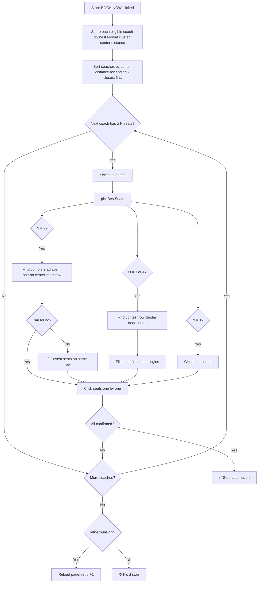

# 💺 Booking Logic — Seat Selection Algorithm

This document explains how the extension selects seats for 1 to 4 passengers, including coach selection, pair detection, center preference, and all fallback strategies.

---

## Overview

```
┌─────────────────────────────────────────────────────────────┐
│  1. Class Selection (handleTrainSelection)                  │
│     → Pick best class from priority list with enough seats  │
│                                                             │
│  2. Coach Selection (handleSeatSelection)                   │
│     → Try coaches whose best cluster is closest to center   │
│                                                             │
│  3. Seat Picking (pickBestSeats)                            │
│     → Select optimal adjacent seats near center             │
│                                                             │
│  4. Seat Clicking & Verification                            │
│     → Click each seat, verify selection, handle errors      │
│                                                             │
│  5. Stop                                                    │
│     → Automation stops. User continues manually.            │
└─────────────────────────────────────────────────────────────┘
```

---

## Phase 1: Class Selection

Before seats are picked, the extension decides **which class** to book.

**Input:** User's class priority list (e.g., `[SNIGDHA, AC_S, S_CHAIR]`) and passenger count.

**Logic:**
1. For each class in priority order, find the matching card on the train.
2. Parse the **available ticket count** from the card text:
   ```
   SNIGDHA
   ৳788
   Available Tickets (Counter + Online)
   1                ← this number is parsed
   ```
3. If `available < passengerCount` → **skip** this class, even if BOOK NOW is visible.
4. If `available >= passengerCount` and BOOK NOW exists → **click it**.
5. If no class qualifies on this train → advance to the next train in the
   priority list; only after ALL trains × classes fail does the retry counter
   increment (max 3 full sweeps, then reload).

```
Example:
  Need: 2 seats
  Priority: SNIGDHA → AC_S → S_CHAIR

  SNIGDHA: 1 available → SKIP (1 < 2)
  AC_S:    0 available → SKIP
  S_CHAIR: 31 available → ✅ BOOK (31 >= 2)
```

> **Key rule:** Availability > Class priority. A lower-priority class with enough seats wins over a higher-priority class with insufficient seats.

---

## Phase 2: Coach Selection

After BOOK NOW is clicked, the seat layout opens with a coach dropdown.

**Goal:** pick the coach whose **best N-seat cluster sits closest to the coach center** — total availability is irrelevant beyond the bare minimum of `passengerCount` seats.

**Center definition:** `centerSeat = (totalSeatsInCoach + 1) / 2`, where `totalSeatsInCoach` = every seat button rendered in that coach's layout (available + booked + blocked). Seat numbers map to rows via the layout geometry (Phase 3), so scoring uses real row positions, not raw numbers.

**Logic:**
1. Parse all coach options: `"KA - 4 Seat(s)"`, `"KHA - 25 Seat(s)"`, etc.
2. Skip coaches with fewer seats than `passengerCount`; skip XTR/EXTRA coaches.
3. **Score every remaining coach** (switch → wait for render → `scoreCoach()`):
   - Build the full seat map (all seats, so `centerY` reflects the whole coach).
   - Find the best valid group of `passengerCount` seats using the Phase 4 rules (adjacent pair for 2, tight cluster for 3–4).
   - `coachScore = |clusterMidY - centerY|` → **lower is better**.
   - No valid group → score = `Infinity` (coach effectively skipped).
4. **Sort coaches ascending by `coachScore`** (closest-to-center first), NOT by seat count.
5. Try coaches in that order; click the first coach whose seats confirm.

```
Example — need 2 seats:
  KA : 4 available  → best pair [32, 33], distance from center =  6  ← WINS
  KHA: 25 available → best pair [22, 23], distance from center = 14

  Old logic would have tried KHA first (more seats).
  New logic books KA 32+33 even though KA only has 4 free seats.
```

> **Why center-first?** Travelers care about *where* they sit, not how many other empty seats exist. A 4-seat coach that happens to have a center pair beats a 25-seat coach whose only pairs are at the very front or back. Total count is used only as the hard eligibility filter (`count >= passengerCount`).

---

## Phase 3: Seat Layout Understanding

The algorithm uses **visual position** (`getBoundingClientRect()`) — it does NOT hardcode seat numbers. This makes it work on any coach layout.

### Typical Bangladesh Railway Coach Layout

```
          LEFT SIDE          │ AISLE │         RIGHT SIDE
     ┌──────────┬──────────┐ │       │ ┌──────────┬──────────┐
     │  WINDOW  │  AISLE   │ │       │ │  AISLE   │  WINDOW  │
     ├──────────┼──────────┤ │       │ ├──────────┼──────────┤
R1   │  DHA-1   │  DHA-2   │ │       │ │  DHA-3   │  DHA-4   │
R2   │  DHA-5   │  DHA-6   │ │       │ │  DHA-7   │  DHA-8   │
R3   │  DHA-9   │  DHA-10  │ │       │ │  DHA-11  │  DHA-12  │
R4   │  DHA-13  │  DHA-14  │ │       │ │  DHA-15  │  DHA-16  │  ← center
R5   │  DHA-17  │  DHA-18  │ │       │ │  DHA-19  │  DHA-20  │  ← center
R6   │  DHA-21  │  DHA-22  │ │       │ │  DHA-23  │  DHA-24  │
R7   │  DHA-25  │  DHA-26  │ │       │ │  DHA-27  │  DHA-28  │
R8   │  DHA-29  │  DHA-30  │ │       │ │  DHA-31  │  DHA-32  │
     └──────────┴──────────┘ │       │ └──────────┴──────────┘
```

### How the algorithm detects the layout:

1. **Row detection:** All seat buttons are grouped by Y coordinate (±15px tolerance). Seats at the same vertical position = same row.

2. **Aisle detection:** Within each row, seats are sorted left-to-right by X coordinate. The **largest horizontal gap** between consecutive seats = the aisle.

3. **Pair detection:** Seats on the same side of the aisle form **pairs** (groups of 2). Each pair has one window seat and one aisle seat.

```
Row sorted by X:  [DHA-1, DHA-2,  ← 50px gap →  DHA-3, DHA-4]
                   \___ pair ___/   (aisle gap)   \___ pair ___/
                   left pair                      right pair
```

4. **Center calculation:** The vertical center of all rows is computed: `centerY = (topRow.y + bottomRow.y) / 2`. Rows closest to `centerY` are scored highest.

---

## Phase 4: Seat Picking — By Passenger Count

### 🧑 1 Passenger

**Goal:** Single best seat near the center of the coach.

**Algorithm:**
1. Calculate `centerScore(y) = |seatY - centerY|` for each available seat.
2. Sort by score ascending.
3. Return the seat with the lowest score (= closest to center row).

```
Result: 1 seat, center-most row

Example (32-seat coach, center = R4-R5 boundary):
  Available: DHA-2, DHA-14, DHA-22, DHA-30
  Scores:    high,  LOW ✅,  low,    high
  Picked:    DHA-14 (center row R4)
```

---

### 👫 2 Passengers

**Goal:** Adjacent pair — one window, one aisle — on the same row, as close to center as possible. **Never** on two different rows.

**Algorithm:**
1. For every row in the layout, extract all pairs (left pair, right pair).
2. Check which pairs have **both seats available**.
3. Score each valid pair by `centerScore(pair.y)`.
4. Pick the pair with the **lowest score** (= nearest to center).

```
Result: 2 adjacent seats, same row, one window + one aisle

Example:
  Row R4 left pair:  [DHA-13, DHA-14] → both available? YES → score: 10
  Row R4 right pair: [DHA-15, DHA-16] → both available? NO (DHA-15 booked)
  Row R5 left pair:  [DHA-17, DHA-18] → both available? YES → score: 12
  Row R3 right pair: [DHA-11, DHA-12] → both available? YES → score: 25

  Winner: [DHA-13, DHA-14] ✅ (score 10, center-most)
```

**Fallback chain:**

```
 ┌─ Try 1: Complete adjacent pair (both available), center-most row
 │
 ├─ Try 2: If no complete pair exists →
 │         Find 2 closest seats on the same row (center-most row first)
 │         Sort available seats in that row by X, pick the 2 with
 │         smallest X gap between them
 │
 └─ Try 3: If no row has 2 available seats →
           Pick 2 seats closest to center individually
           (last resort — different rows)
```

---

### 👨‍👩‍👦 3 Passengers

**Goal:** Tight cluster across minimum rows (ideally 1 row with a pair + 1 extra, or 2 adjacent rows). Prefer complete pairs. Center-most position.

**Algorithm:**
1. Try all windows of **consecutive rows**, starting with span=1 (single row), then span=2 (two adjacent rows), etc.
2. For each window, count available seats. If `>= 3`, this is a candidate.
3. Score: `|clusterMidY - centerY| + span × 5`
   - Closer to center = better
   - Fewer rows = better (penalize extra rows by +5 per row)
4. Within the winning cluster, fill seats by:
   - **Complete pairs first** (window+aisle together)
   - **Then singles** to reach the count
   - Center-most rows within the cluster are filled first

```
Result: 3 seats, 1-2 rows, with at least one complete pair

Example (need 3, center = R4-R5):
  Span 1:
    Row R4: available = [DHA-13, DHA-14, DHA-16] → 3 seats ✅
    Score = |R4.y - center| + 1×5 = 10 + 5 = 15
    Fill: pair [DHA-13, DHA-14] first, then single DHA-16
    Picked: [DHA-13, DHA-14, DHA-16] ✅

  (span 1 found a cluster → stop, don't try span 2)
```

**If span=1 can't fit 3 seats in any row:**
```
  Span 2:
    Rows R4+R5: available = [DHA-14, DHA-17, DHA-18, DHA-20] → 4 >= 3 ✅
    Score = |mid(R4,R5) - center| + 2×5 = 2 + 10 = 12
    Fill: pair [DHA-17, DHA-18] from R5 (more centered), then DHA-14 from R4
    Picked: [DHA-17, DHA-18, DHA-14]
```

---

### 👨‍👩‍👧‍👦 4 Passengers

**Goal:** Same as 3 but need 4 seats. Ideally 2 complete pairs on the same row, or 1 pair per row across 2 adjacent rows.

**Algorithm:** Same cluster logic as 3 passengers.

```
Result: 4 seats, 1-2 rows, ideally 2 complete pairs

Example — Best case (1 row):
  Row R5: available = [DHA-17, DHA-18, DHA-19, DHA-20] → 4 seats ✅
  Fill: left pair [DHA-17, DHA-18] + right pair [DHA-19, DHA-20]
  Picked: [DHA-17, DHA-18, DHA-19, DHA-20] ✅ ← entire row!

Example — 2 rows:
  Row R4: available = [DHA-13, DHA-14] (left pair)
  Row R5: available = [DHA-17, DHA-18] (left pair)
  Span 2 cluster: 4 available ✅
  Fill: pair [DHA-13, DHA-14] + pair [DHA-17, DHA-18]
  Picked: [DHA-13, DHA-14, DHA-17, DHA-18] ← 2 pairs on adjacent rows
```

**Fill order within a cluster:**
```
 ┌─ 1. Sort rows by center distance (center-most first)
 │
 ├─ 2. For each row: add COMPLETE available pairs first
 │      (ensures window+aisle togetherness)
 │
 └─ 3. Then add remaining available singles from that row
        (to reach the target count)
```

---

## Phase 5: Seat Clicking & Verification

After `pickBestSeats()` returns the selected buttons:

1. For each seat:
   - Scroll into view
   - Click (native `.click()`)
   - Wait up to 10 seconds for `seat-selected` CSS class to appear
   - If a SweetAlert error popup appears → skip that seat
   - If confirmed → increment counter

2. If `confirmedCount >= passengerCount`:
   - Show success notification with seat names
   - **Stop all automation** (observer disconnected, retry counter cleared)
   - User continues manually (clicks CONTINUE PURCHASE themselves)

3. If not enough seats confirmed in this coach:
   - Try next coach (back to Phase 2)
   - If all coaches exhausted → advance the train × class matrix:
     - Next class on the same train (URL `?class=` param), or
     - When all classes are done, next train in the priority list
       (navigate back to the train-results page)
   - Only when the FULL matrix is swept does the retry counter increment
   - After 3 full sweeps → **hard stop** with error notification

---

## Retry Logic (Train × Class Matrix Sweeps)

The agent walks a booking **matrix**: trains (outer loop, user priority order)
× classes (inner loop, user priority order). One "try" = one complete sweep of
every cell in that matrix — NOT one attempt per train.

```
Example: trains [Chattala, Turna], classes [SNIGDHA, AC_S]

TRY 1: Chattala→SNIGDHA ✗ → Chattala→AC_S ✗ → Turna→SNIGDHA ✗ → Turna→AC_S ✓ BOOK!
        (if all four fail → retryCount = 1, reload, start TRY 2 from Chattala→SNIGDHA)
```

```
RETRY COUNTER
  Stored in: sessionStorage('etb_retryCount')
  Survives:  page reloads
  Cleared:   on success, on stop, on browser close
  Max:       3 FULL MATRIX SWEEPS

  Cell outcomes (no counter change):
  - Train not listed on route → skip to next train in the list
  - Class card missing / insufficient seats / no BOOK NOW → next matrix cell
  - Seat layout opens but no coach has N seats → next matrix cell

  Counter +1 only when:
  - The sweep wrapped past the LAST train's LAST class
    (also covers: all preferred trains absent from search results)
  - No preferred trains set and first-available train has no bookable class

  After 3 sweeps:
  STOP — "Stopped after 3 attempts" → automation killed
```

---

## Decision Flowchart



---

## Summary Table

| Passengers | Row Constraint | Pair Constraint | Center Preference | Fallback |
|:---:|---|---|---|---|
| **1** | Any row | N/A | Center-most row | Closest available |
| **2** | **Same row only** | **Must be adjacent pair** (window+aisle) | Center-most row with a complete pair | Same-row closest → any 2 center seats |
| **3** | 1-2 rows max | Complete pairs preferred | Center-most cluster | Expand span, then individuals |
| **4** | 1-2 rows max | 2 complete pairs preferred | Center-most cluster | Expand span, pairs first then singles |
